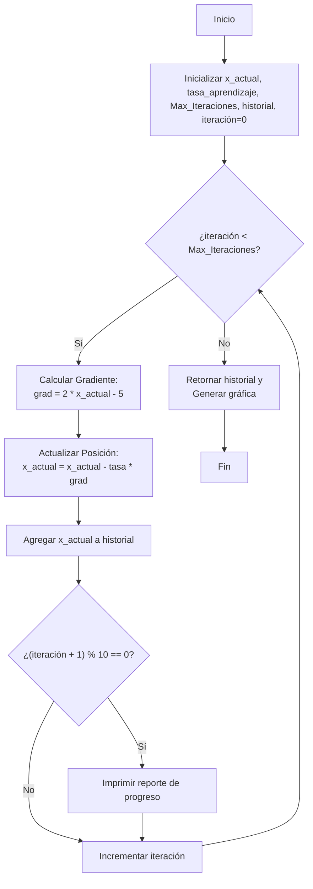

# Documentación del Algoritmo: Gradiente Descendente 1D

Este documento describe la lógica del algoritmo implementado en `gradiante.py` para optimizar la función $f(x) = x^2 - 5x + 10$.

## 1. Pseudocódigo
```text
Algoritmo Gradiente_Descendente_1D
    // Inicialización
    x_actual = punto_inicio
    tasa_aprendizaje = valor_tasa
    Max_Iteraciones = valor_iteraciones
    historial = [x_actual]
    iteración = 0
    
    Mientras iteración < Max_Iteraciones Hacer:
        // Cálculo del Gradiente (Derivada de x² - 5x + 10)
        grad = 2 * x_actual - 5
        
        // Actualización de la posición (Movimiento en contra del gradiente)
        x_actual = x_actual - (tasa_aprendizaje * grad)
        
        // Registro de la trayectoria para visualización
        Agregar x_actual a historial
        
        // Reporte de progreso cada 10 iteraciones
        Si (iteración + 1) % 10 == 0 Entonces:
            Imprimir(iteración + 1, x_actual, f(x_actual))
        FinSi
        
        iteración = iteración + 1
    FinMientras
    
    Retornar historial
FinAlgoritmo
```

## 2. Diagrama de Flujo (Mermaid)



## 3. Especificaciones Matemáticas
- **Función Objetivo:** $f(x) = x^2 - 5x + 10$
- **Derivada (Gradiente):** $f'(x) = 2x - 5$
- **Punto de Convergencia:** El algoritmo busca el valor donde $f'(x) = 0$, que es $x = 2.5$.
