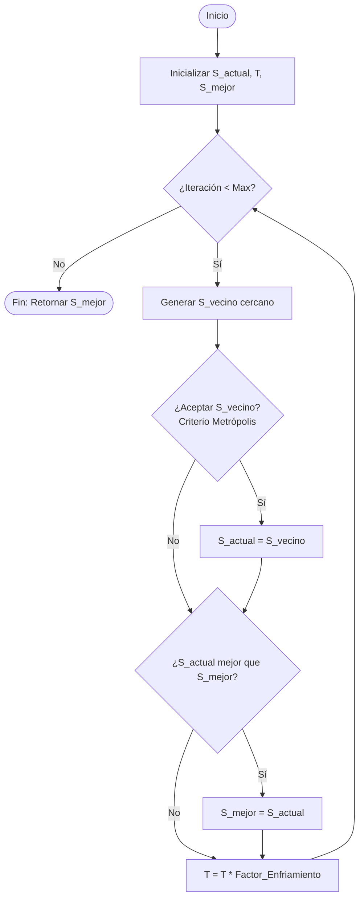
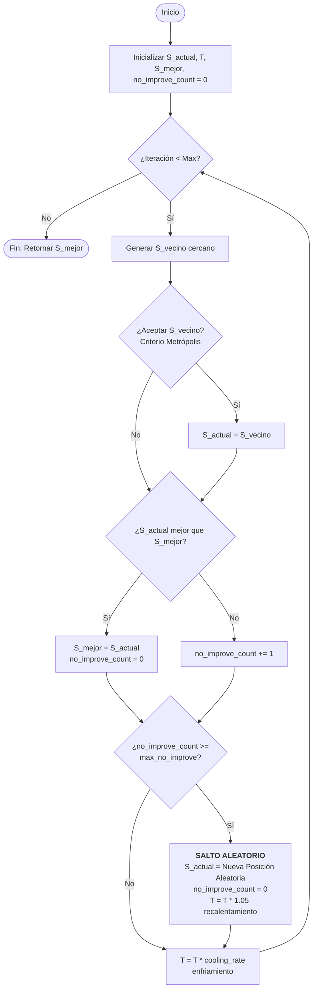

# Pseudocódigo y Diagramas de Flujo - Temple Simulado

Este documento detalla la lógica de las dos versiones del algoritmo de Temple Simulado (Simulated Annealing) implementadas en esta práctica.

---

## 1. Temple Simulado Estándar
Sigue una trayectoria continua y utiliza el criterio de Metrópolis.

### Pseudocódigo
```text
Algoritmo Temple_Simulado_Estandar
    // Inicialización
    S_actual = Generar_Solucion_Aleatoria()
    T = T_inicial
    S_mejor = S_actual
    
    Mientras T > T_final Y iteración < Max_Iteraciones Hacer:
        // Generar un vecino cercano (Búsqueda Local)
        S_vecino = Generar_Vecino(S_actual)
        
        Delta_E = Energia(S_vecino) - Energia(S_actual)
        
        // Criterio de Aceptación (Metrópolis)
        Si Delta_E < 0 Entonces:
            S_actual = S_vecino
        Sino:
            Probabilidad = exp(-Delta_E / T)
            Si Aleatorio(0, 1) < Probabilidad Entonces:
                S_actual = S_vecino
        FinSi
        
        // Actualizar mejor solución global
        Si Energia(S_actual) < Energia(S_mejor) Entonces:
            S_mejor = S_actual
        FinSi
        
        // Enfriamiento Geométrico
        T = T * Factor_Enfriamiento
        iteración = iteración + 1
    FinMientras
    
    Retornar S_mejor
FinAlgoritmo
```

### Diagrama de Flujo


---

## 2. Temple Simulado Híbrido (Clase)
Incluye detección de estancamiento, saltos aleatorios y recalentamiento.

### Pseudocódigo
```text
Algoritmo Temple_Simulado_Hibrido
    // Inicialización
    S_actual = Generar_Solucion_Aleatoria()
    T = T_inicial
    S_mejor = S_actual
    no_improve_count = 0
    
    Mientras T > T_final Y iteración < Max_Iteraciones Hacer:
        S_vecino = Generar_Vecino(S_actual)
        Delta_E = Energia(S_vecino) - Energia(S_actual)
        
        // Intento de movimiento
        Si Criterio_Metropolis(Delta_E, T) es Aceptado Entonces:
            S_actual = S_vecino
        FinSi
        
        // Gestión de Mejora y Estancamiento
        Si Energia(S_actual) < Energia(S_mejor) Entonces:
            S_mejor = S_actual
            no_improve_count = 0  // Reiniciar contador
        Sino:
            no_improve_count = no_improve_count + 1
        FinSi
        
        // Salto Aleatorio por Estancamiento
        Si no_improve_count >= Max_No_Mejora Entonces:
            S_actual = Generar_Solucion_Aleatoria()  // Reinicio en otro punto
            T = T * 1.05                             // Recalentamiento leve
            no_improve_count = 0
        FinSi
        
        T = T * Factor_Enfriamiento
        iteración = iteración + 1
    FinMientras
    
    Retornar S_mejor
FinAlgoritmo
```

### Diagrama de Flujo

